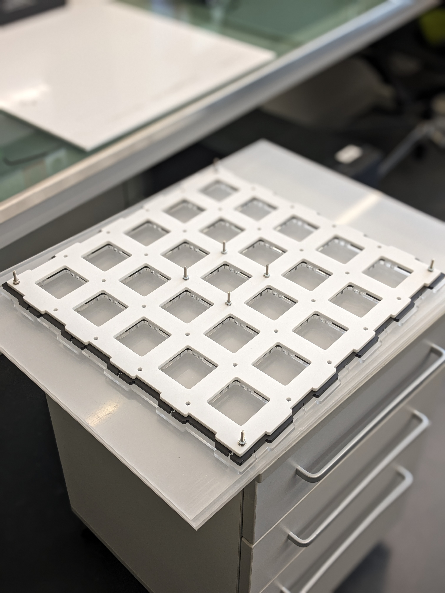

# modular-skinner-box

## Overview
Drawings for cutting all the necessary pieces for assembling a modular behavioral box for rats and mice.

## Project Structure

- **drawings/**: Contains the vector graphics files for all the box components (i.e., walls & modules).
  - **wall.ai**: Bla bla bla.
  
- **media/**: Contains photos, videos & sketches illustrating some of the mechanisms.
  
- **print/**: Contains print/cut-ready .pdf files.

## Usage
...

### wall

### modules (unassembled)

### box (unpopulated)

### box (populated)

### box (running)

### box (inside)

### rig

