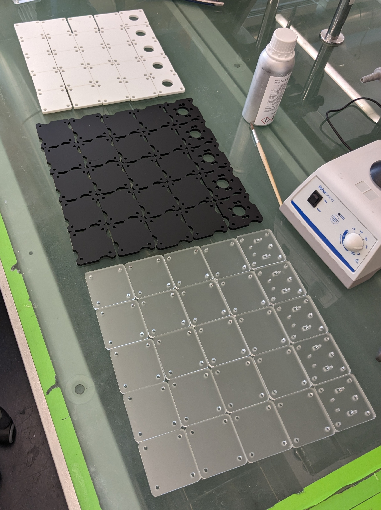
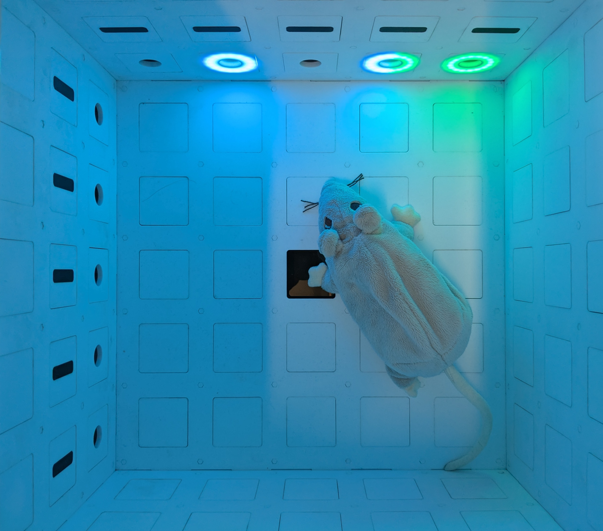
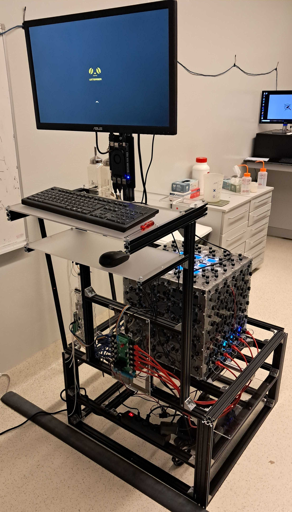

# Modular behavioral box
Drawings for cutting all the necessary pieces for assembling a modular behavioral box for rats and mice using 5-mm-thick acrylic.

## Project structure
- **drawings/**: Contains vector graphics files for all components of the box (i.e., walls & modules).
- **media/**: Contains photos, videos & sketches illustrating some of the mechanisms and assembly steps.
- **print/**: Contains all print/cut-ready .pdf files.

## Parts list

- General:
  - 5-mm-thick acrylic;
  - acrylic glue;
  - 20-mm M3 spacers;
  - 10-mm M3 screws;
  - M3 nuts;

- Specific to poke & light modules:
  - NeoPixel 16-LED RGB rings;

## Assembly

### Building one box, one wall at a time:
1. Print/cut the [print/wall/inner.pdf](print/box/inner.pdf) file in a 600x400 mm sheet of 5-mm-thick acrylic of your chosen color for the inside layer of the box (**white** in the examples below);
2. ...
3. ...

### Building two boxes in one go:
1. Print/cut the [print/two-boxes/inner.pdf](print/box/inner.pdf) file in a 3000x1520 mm sheet of 5-mm-thick acrylic of your chosen color for the inside layer of the box (**white** in the examples below);
2. Print/cut the [print/two-boxes/middle.pdf](print/box/middle.pdf) file in a 3000x1520 mm sheet of 5-mm-thick acrylic of your chosen color for the intermediate layer of the box (**black** in the examples below);
3. Print/cut the [print/two-boxes/outer.pdf](print/box/outer.pdf) file in a 3000x1520 mm sheet of 5-mm-thick acrylic of your chosen color for the outside layer of the box (**crystal** in the examples below);

### Populating boxes with modules:
1. ...
2. ...
3. ...

### wall

### modules (unassembled)

### box (unpopulated)

### box (populated)

### box (running)

### box (inside)

### rig

